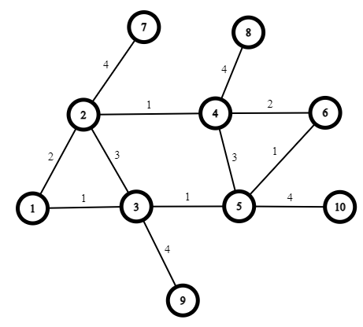

# Distance Vector Routing
Dynamic implementation of Distance Vector Algorithm and parallel simulation of the algorithm.

## Usage:
Find the shortest path and route network packets based on it. Send a message through your desired network! Change the network dynamically and watch how it affects routing your message.

## Implementation:
sockes are used to create real connections between each pair of connected nodes.
A thread is used for CLI to test the algorithm and modify the network, and it has access to nodes. In this way, we have simulated the network, and we can create a new node, edge, or disconnect an existing edge by entering the appropriate command. Each node is only aware of its neighbors, and they don't have access to the network structure.
Bellman-Ford algorithm is used for finding the shortest path in the DVR algorithm.
Because sockets listen for messages parallelly and the algorithm runs simultaneously, it creates critical sections. So, the implementation has Mutex and Waitgroup(Semaphore).

## Parameters:
`MaxResponseTime`: The maximum time to wait for a response. If no response is received, the algorithm assumes that the connection has a problem and removes it from the routing table.

`MaxNode`: The limit of number of nodes in the simulation. You can easily change that.

`MaxHop`: Maximum number of intermediate nodes to consider a path valid. It is used to prevent count to infinity problem.

`PortOffset`: The offset used for the port of the sockets. For node id, the port PortOffset+id is being used.

`TTL`: is the total time to live for messages. It can be increased when using more extensive networks.

## CLI Commands:
### Create a new node
```
addNode id neighbors_count
```
Adds a new node to the network with the given id for the new node.
neighbors_count determines the number of current neighbors for the new node. To facilitate building the network, you can add neighbors of the new node in this stage. if neighbors_count > 0 in each of the next neighbors_count lines provide an edge description in `id2 weight` format.

---
### Remove an existing node
```
deleteNode id
```
Deletes the node id. To make the simulation more realistic, the socket connections of the deleted node will remain connected, but they will go unresponsive. It doesn't contribute to sending messages or DVR algorithm. Because of the smart implementation of the routing algorithm, the other sides of its edges notice this change automatically after a period and change their routing table :).

---
### Add a new edge to the network
```
addEdge id1 id2 weight
```
Creates a new edge between id1 and id2 nodes with the given cost.

---
### Modify the weight of an existing edge
```
editEdge id1 id2 weight
```
Changes the cost of the connection between id1 and id2 to the given cost.

---
### Show routing table
```
showRoutingTable id
```
Prints the routing table of the node id. It shows where to send the packet with the given destination.

---
### Show distance vector
```
showDistanceVector id
```
Prints the distance vector of node id. It illustrates the current cost of sending a message from node id to any other node.

---
### Send a message
```
message "text" id1 id2
```
Sends an arbitrary message from id1 to id2. This can also be used to find the path from id1 to id2. The message has a TTL field to prevent it from looping around the network.

---
### Exit
```
exit
```
Terminates the simulation.


## How to run:
Run the following command in the terminal and enter the mentioned simulation commands based on your need.

```bash
go run main.go
```

## Example:


here is commands to create the example network:

```bash
addNode 1 0
addNode 2 1
1 2
addNode 3 2
1 1
2 3
addNode 4 1
2 1
addNode 5 2
3 1
4 3
addNode 6 2
4 2
5 1
addNode 7 1
2 4
addNode 8 1
4 4
addNode 9 1
3 4
addNode 10 1
5 4
```